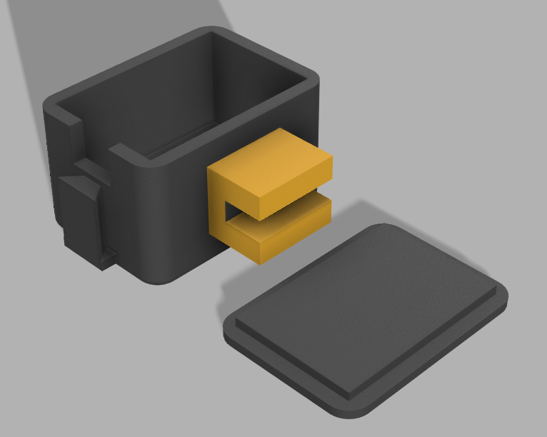

## Solar meter reading

A (almost) complete system for reading an electricity meter and uploading the data to a google spreadsheet. The project was to record a meter that records solar energy generation and upload it to a spreadsheet. Some sample images are taken each night and a network is train by hand annotated images.

OpenCV is used to extract the individual digits and sklearn is used to train the classifier. Tkinter is used to annotate the training set. An ESP32-CAM is used to capture the images with a ring of LED lights.

The camera captures and image of the meter each night and uploads it to a server which runs it against the model and uploads the reading to a spreadsheet. The only code missing from this repo is the server side image processing.

### This is the meter reading recorded over 1 Year

